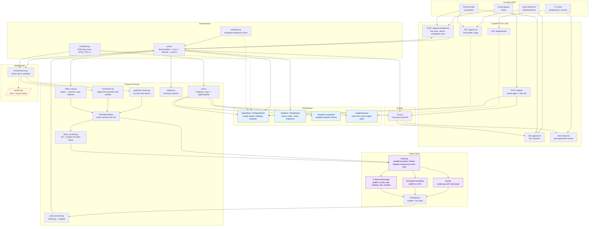

# Backend DAG - System Dataflow

This is the current backend shape for the QTW 2026 trading game: kiosk signup,
phone retunes, live mark-to-market updates, scheduled rebalances, persistence,
and the solver race.

## Current Status

- FastAPI is the long-lived backend process. It owns HTTP routes, websocket
  routes, the in-process event bus, the MTM loop, and the scheduled rebalance
  loop.
- `DATABASE_URL` selects SQL-backed stores for Supabase/Postgres. When unset,
  the same store interfaces use in-memory dictionaries for local/offline work.
- `MARKET_DATA_SOURCE` defaults to `assets-api`; `synthetic` remains available
  for tests and offline demos.
- D-Wave joins the race only when `DWAVE_API_TOKEN` is set. Gurobi should stay
  out of the production race with `GUROBI_IN_RACE=0`.
- Scheduled rebalances are implemented. They call the same optimization path as
  manual retunes, so they are QPU-capable when D-Wave is configured.
- The backend Docker image build is implemented. Proton SMTP sending, QPU budget
  limits, and droplet deploy automation are still pending.

## High-Level DAG



## Main Flows

### 1. Create Agent

`POST /agents` validates the selected basket, stores the agent config, and
returns:

- `agentId`
- `qrUrl`, built from `QR_BASE_URL/p/{agentId}`
- starting bankroll

No solve happens here. The kiosk calls optimize after creation.

### 2. First Solve / Manual Retune

`POST /agents/:id/optimize` runs the full optimization pipeline.

1. Load the agent from `AgentStore`.
2. Apply any changed sliders or basket.
3. Fetch hourly returns from the configured market data source.
4. Estimate expected returns and covariance from real returns only.
5. Build the mean-variance problem:

   minimize: gamma over 2 times portfolio variance minus expected return

   subject to: weights sum to 1, and every selected asset stays between
   `w_min` and `w_max`

6. Race providers:
   - Gurobi solves the continuous QP when enabled.
   - Simulated annealing solves the QUBO on CPU.
   - D-Wave solves the same QUBO on QPU when `DWAVE_API_TOKEN` is set.
7. Keep all provider results for display/audit.
8. Pick the feasible result with the lowest reported solve/access time.
9. Liquidate the previous basket at spot and allocate the full value into the
   winning weights.
10. Persist holdings, solve metadata, solve snapshots, and rebalance timestamps.
11. Publish an immediate `AgentUpdate` over the per-agent websocket.

Current code treats every solve as a fresh allocation. There is no turnover
penalty and no transaction fee in the live path.

### 3. Scheduled Rebalance

`run_scheduled_rebalance_loop` checks active agents every
`REBALANCE_CHECK_TICK_S`.

- Active means the agent has holdings from at least one prior solve.
- If `next_rebalance_at` is missing on a hydrated active agent, the backend
  initializes it from the current slider cadence.
- When due, the loop calls `run_optimization` with the existing sliders and
  basket.
- Because it uses the normal optimization path, scheduled/background rebalances
  are QPU-capable when D-Wave is configured.
- Failures are logged and retried after `REBALANCE_RETRY_BACKOFF_S`.

This loop is separate from MTM so a solve does not block valuation pushes.

### 4. Mark-To-Market

`run_mtm_loop` runs every `MTM_TICK_S`.

1. Collect all tickers currently held by active agents.
2. Fetch one spot snapshot for that ticker set.
3. Revalue each agent's units against spot.
4. Update the in-memory hot path with `set_valuation`.
5. Persist sampled analytics rows every `VALUATION_SNAPSHOT_INTERVAL_S` when
   SQL-backed stores are enabled.
6. Publish an `AgentUpdate` over websocket.

The frequent MTM path does not write every tick to Postgres. Durable valuation
history is sampled for analytics.

## Solver Race Semantics

The race does not stop at the first feasible response anymore. The router
collects finished provider results until the overall deadline, marks infeasible
and failed providers, and then chooses the feasible solution with the lowest
reported solve/access time.

Important details:

- D-Wave's displayed time is QPU access time, not network round-trip.
- Gurobi should be disabled in production with `GUROBI_IN_RACE=0`.
- The legacy `vsClassical` field remains for older clients, but the frontend now
  renders the ranked `solverResults` list and percentage margin.
- If no provider returns a feasible solution before the deadline, the API returns
  `503`.

## Persistence Semantics

The code uses store interfaces everywhere:

- `AgentStore` / `DbAgentStore`
- `JobStore` / `DbJobStore`

Selection is environment-driven:

- `DATABASE_URL` unset: in-memory store.
- `DATABASE_URL` set: SQL-backed store, usually Supabase/Postgres.

`DbAgentStore` subclasses the in-memory store. On startup it loads the working
set from the database into memory. Human-paced operations write through to SQL:

- create agent
- update sliders
- update basket
- apply solve
- initialize missing rebalance timestamps

MTM valuations update the in-memory working set every tick. Durable valuation
snapshots are sampled separately.

## Runtime Boundaries

- Frontend env (`VITE_API_BASE`, optional `VITE_WS_BASE`) belongs in Netlify.
- Backend env (`DATABASE_URL`, `ASSETS_API_BASE_URL`, `DWAVE_API_TOKEN`,
  `QR_BASE_URL`, SMTP secrets later) belongs only on the backend host/container.
- Supabase hosts Postgres only; the browser never connects to the database.
- assets-api owns provider fallback, rate-limit protection, quote freshness, and
  history/spot caching.
- QTW backend owns agent state, solver dispatch, MTM, scheduled rebalances,
  leaderboard, and websocket pushes.

## Single-Worker Constraint

The current event bus and schedulers are in-process. Run one Uvicorn worker for
the first production deployment:

```bash
uvicorn backend.api.app:app --host 0.0.0.0 --port 8000 --workers 1
```

Multiple backend workers would need an external event bus and scheduler
coordination, such as Redis pub/sub plus a distributed lock, or Postgres
LISTEN/NOTIFY plus advisory locks.

## Still Missing

- Proton SMTP sender: email/consent fields are stored, but no backend email
  sender exists yet.
- Droplet deploy automation: the Dockerfile exists, but CI/registry/pull-and-
  restart wiring is still pending.
- QPU budget and retune rate limits: scheduled rebalances and manual retunes are
  QPU-capable, but token-bucket enforcement is still pending.
- assets-api spot freshness: QTW consumes the spot contract; faster freshness
  belongs in `../assets-api`.
- MTM cadence alignment: once assets-api spot freshness is finalized, align
  `MTM_TICK_S` with that cadence.
