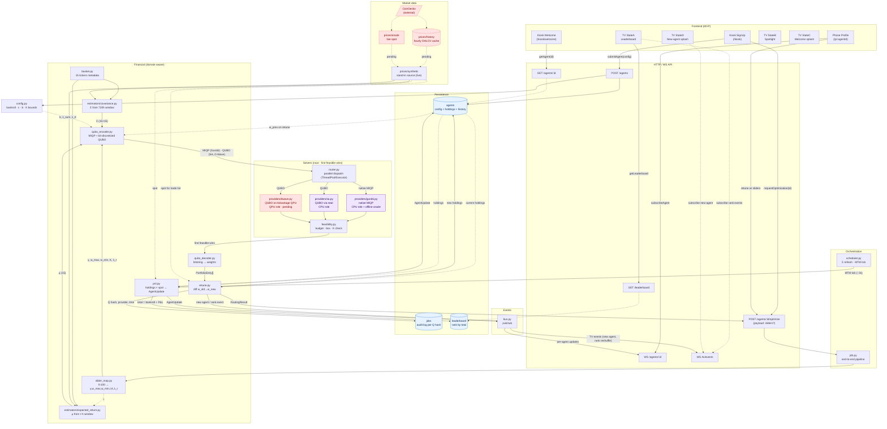

# Backend DAG — System dataflow

Full dataflow for the QTW 2026 Trading Game backend, from frontend touch through
solver race back to live MTM updates. Solid arrows = synchronous data flow;
dotted arrows = reads from persistence or external data.

**Legend.** **Red dashed = pending (not yet built):** CoinGecko + `prices/history`
+ `prices/oracle` (live market data) and the D-Wave provider. A deterministic
**synthetic source stands in for the data layer today**, behind the same
interface. Blue = persistence stores; purple = live solvers; the frontend MVP
runs on **mocks** until it's wired to the real API.

**What's left, in order:** ① live market data → ② frontend wiring → ③ D-Wave provider (last).

## Reading the DAG

- **Top → bottom = user request flow**: frontend kiosk/phone touch → API → orchestration job → financial pipeline → solver race → decode → persist → respond.
- **Bottom = MTM background loop**: the scheduler ticks the PnL module every few seconds, revalues holdings against the current spot, updates persistence, and pushes deltas over WS.
- **Dotted arrows = reads** (from persistence or external data); solid arrows = synchronous data flow.
- **Data layer**: the estimators and PnL read from `prices/synthetic` today (live). The red-dashed `history` / `oracle` / CoinGecko path replaces it later behind the same interface — no pipeline change.
- **Three solver paths converge at `feasibility.py`** — first feasible wins. Gurobi additionally serves as the offline oracle (separate from the race).

## Solver race — how it connects

One canonical problem fans out to the solvers in two encodings — MIQP for Gurobi,
the bit-discretized QUBO for SA and D-Wave — and the **first feasible** answer wins.

- **The canonical problem.** `orchestration/job.py` assembles a `MIQPProblem`
  (`financial/types.py`) from the slider params (`slider_map.py`), the estimates
  (μ, Σ), and `w_prev` on a retune. That single object is the source of truth.
- **The router** (`solvers/router.py::race`) encodes the QUBO once, hashes it for
  the audit log, and dispatches the providers concurrently on a thread pool (the
  solve work releases the GIL). It takes the first feasible result and keeps the
  runner-up for the `vsClassical` baseline (decision Q7).
- **Encodings.** Gurobi reads the MIQP natively; SA and D-Wave solve the QUBO and
  decode the winning bitstring (`qubo_decoder.py`) to weights. Gurobi is also the
  offline oracle that calibrates penalty weights.
- **Feasibility gate** (`solvers/feasibility.py`) is identical for all three —
  budget `|Σwᵢ−1| < ε`, box `0 ≤ wᵢ ≤ w_max`, **exactly-K** positions. Cheap,
  deterministic, no oracle in the hot path (decision Q6).
- **D-Wave (pending, last).** Solves the *same* QUBO SA does, on the QPU via the
  Ocean SDK. Only the body is unimplemented; the `solve_qubo`/`QPU` contract is in
  place so it drops straight into the race once a Leap token is available.

## Key invariants

1. **`slider_map.py` is the only translator** of 0–100 sliders → physical params (γ, w_max, w_min, τ, K, λ_t). The frontend never sees physical params.
2. **`config.py` owns every static knob** — bankroll, bit precision, penalty weights, ε tolerances, K bounds.
3. **`basket.py` is the single source of the asset universe.**
4. **The MTM loop never enters the solver path** — pure revaluation until the next retune.
5. **One problem, two encodings** — MIQP (Gurobi) and QUBO (SA, D-Wave) minimize the same objective over the same feasible set (budget · box · exactly-K), so the race is meaningful.

## Critical paths

- **Build-and-solve hot path**: `EP3 → JOB → SM → (CE + RE) → QE → RTR → FEAS → QD → RT → AG/JOBS → response`. (`QD` decode applies to a QUBO winner — SA or D-Wave; a Gurobi MIQP winner returns weights directly.)
- **MTM hot loop**: `SCHED → PNL → AG/LB → BUS → EP5`.
- **First-solve vs retune branch lives in `RT` (retune.py)** — invisible to the solvers, which each see a fresh problem in their native form.
