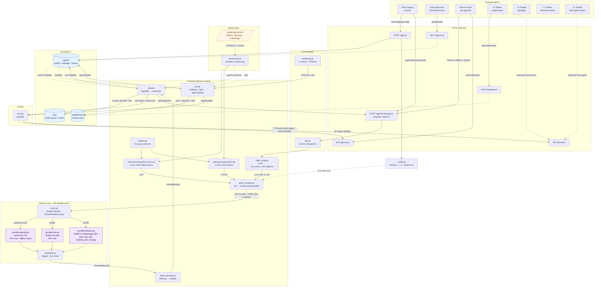

# Backend DAG — System dataflow

Full dataflow for the QTW 2026 Trading Game backend, from frontend touch through
solver race back to live MTM updates. Solid arrows = synchronous data flow;
dotted arrows = reads from persistence or external data.

**Legend.** Blue = persistence stores; purple = solvers; the amber external is
the **assets-api service** (real prices; a deterministic synthetic source is the
default until it's enabled in config). The D-Wave provider is implemented and
joins the race when `DWAVE_API_TOKEN` is set. The frontend MVP runs on **mocks**
until it's wired to the real API.

**What's left, in order:** ① real-data shakeout (assets-api) → ② frontend wiring → ③ scheduled rebalances + QPU budget.

## Reading the DAG

- **Top → bottom = user request flow**: frontend kiosk/phone touch → API → orchestration job → financial pipeline → solver race → decode → persist → respond.
- **Bottom = MTM background loop**: the scheduler ticks the PnL module every few seconds, revalues holdings against the current spot, updates persistence, and pushes deltas over WS.
- **Dotted arrows = reads** (from persistence or external data); solid arrows = synchronous data flow.
- **Data layer**: the estimators and PnL read through `prices/source` — deterministic synthetic by default, the assets-api service when enabled in config. Same interface, no pipeline change.
- **Three solver paths converge at `feasibility.py`** — first feasible wins. Gurobi additionally serves as the offline oracle (separate from the race).

## Solver race — how it connects

One canonical problem fans out to the solvers in two encodings — the continuous
QP for Gurobi, the bit-discretized QUBO for SA and D-Wave — and the **first
feasible** answer wins.

- **The canonical problem.** `orchestration/job.py` assembles a `PortfolioProblem`
  (`financial/types.py`) over the player's basket from the slider params and the
  estimates (μ, Σ). Every solve is a fresh allocation — a retune liquidates and
  reallocates, so there is no turnover anchor; no cardinality constraint either,
  the basket decides participation and a min-position floor keeps every selected
  asset held.
- **The router** (`solvers/router.py::race`) encodes the QUBO once, hashes it for
  the audit log, and dispatches the providers concurrently on a thread pool (the
  solve work releases the GIL). It takes the first feasible result and keeps the
  runner-up for the `vsClassical` baseline (decision Q7).
- **Encodings.** Gurobi solves the QP natively; SA and D-Wave solve the QUBO and
  decode the winning bitstring (`qubo_decoder.py`, simplex-normalized to absorb
  bit-grid error). Gurobi is also the offline oracle for penalty calibration.
- **Feasibility gate** (`solvers/feasibility.py`) is identical for all three —
  budget `|Σwᵢ−1| < ε`, box `w_min ≤ wᵢ ≤ w_max`. Cheap, deterministic, no
  oracle in the hot path (decision Q6).
- **D-Wave.** Solves the *same* QUBO SA does, on Advantage via the Ocean SDK.
  Joins the race only when `DWAVE_API_TOKEN` is set (QPU time costs money); its
  reported solve time is QPU access time, not wall clock.

## Key invariants

1. **`slider_map.py` is the only translator** of 0–100 sliders → physical params (γ, w_max, w_min, τ, K, λ_t). The frontend never sees physical params.
2. **`config.py` owns every static knob** — bankroll, bit precision, penalty weights, ε tolerances, K bounds.
3. **`basket.py` is the single source of the asset universe.**
4. **The MTM loop never enters the solver path** — pure revaluation until the next retune.
5. **One problem, two encodings** — QP (Gurobi) and QUBO (SA, D-Wave) minimize the same objective over the same feasible set (budget · box), so the race is meaningful.

## Critical paths

- **Build-and-solve hot path**: `EP3 → JOB → SM → (CE + RE) → QE → RTR → FEAS → QD → RT → AG/JOBS → response`. (`QD` decode applies to a QUBO winner — SA or D-Wave; a Gurobi QP winner returns weights directly.)
- **MTM hot loop**: `SCHED → PNL → AG/LB → BUS → EP5`.
- **First solve and retune are the same math** — a retune liquidates at spot and reallocates over the (possibly re-selected) basket; the solvers always see a fresh problem.
